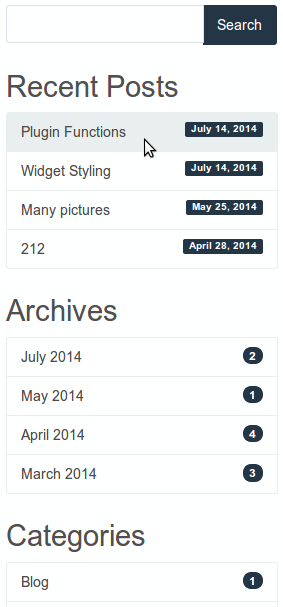
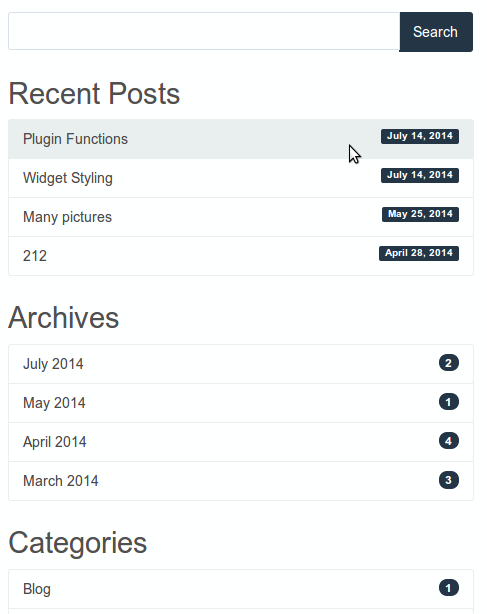
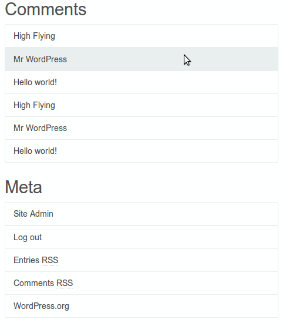
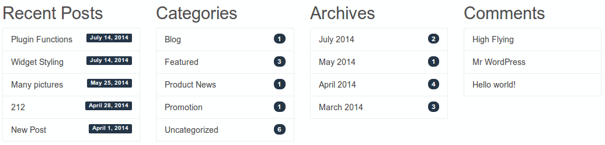
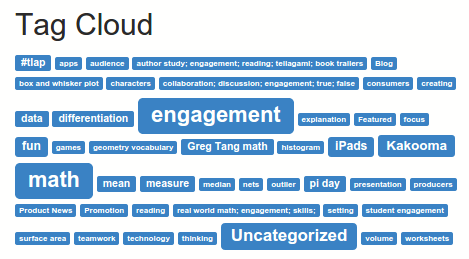

<!-- DO NOT EDIT THIS FILE; it is auto-generated from readme.txt -->
# Bootstrap Widget Styling

Make widgets mobile. A bigger click area and cleaner look for 9 default widgets.

**Contributors:** [ryankienstra](https://profiles.wordpress.org/ryankienstra)  
**Tags:** [Bootstrap](https://wordpress.org/plugins/tags/Bootstrap), [widgets](https://wordpress.org/plugins/tags/widgets), [mobile](https://wordpress.org/plugins/tags/mobile), [responsive](https://wordpress.org/plugins/tags/responsive), [default widgets](https://wordpress.org/plugins/tags/default-widgets)  
**Requires at least:** 3.9  
**Tested up to:** 4.9  
**Stable tag:** 1.0.4  
**License:** [GPLv2 or later](http://www.gnu.org/licenses/gpl-2.0.html)  
**Donate link:** http://jdrf.org/get-involved/ways-to-donate/  
**Requires PHP:** 5.3  

 

## Description ##

* Gives Bootstrap styling to 9 Core widgets: Archives, Categories, Custom Menu, Meta, Pages, Recent Comments, Recent Posts, Search, and Tag Cloud.
* Doesn't send any files to the browser, but you must have Bootstrap 3 or later.
* Doesn't apply to Archives and Categories widgets with dropdowns.
* Disable plugin for certain widget types, using "Settings" page.
* Works with all widgets in the themes "DevDmBootstrap4," "WP Bootstrap 4," and "WP Bootstrap Starter."
* Works with all widgets except for Search on "DevDmBootstrap3," "BPT Bootstrap," and "BootstrapFast."
* Doesn't work at all on "The Bootstrap," "Radiant," "Customizr," and "Inkzine."
* No setup needed, unless you want to disable it for certain widgets.

## Installation ##

1. Upload the bootstrap-widget-styling directory to your /wp-content/plugins directory.
1. In the "Plugins" menu, find "Bootstrap Widget Styling," and click "Activate."
1. If you would like to disable the plugin for certain widgets, click "Settings."

## Frequently Asked Questions ##

### What does this require? ###
Twitter Bootstrap 3 or later.

### Will this change the rest of my page's styles? ###
No, this doesn't use a stylesheet. It only formats widgets so they can use Bootstrap styles.

## Screenshots ##

### Wide click area for mobile devices.

### View from a tablet.

### Click anywhere in the row.

### Bootstrap styling, with post counts and dates.

### The Tag Cloud widget.

## Changelog ##

### 1.0.4 ###
* Fix issue with multiple Archives or Categories widgets.
* Improve how the markup is reformatted, removing the need for the JS file.

### 1.0.3 ###
* Added "Custom Menu" widget Bootstrap styling. The widget looks better when it has only one level of navigation.

### 1.0.2 ###
* Fixed bug where warning appeared in strict mode.
* Integration with the plugin "Adapter Widget Rows."
* Translation-ready, but no translations included.

### 1.0.1 ###
* Tag cloud widget support added. Improved support for the Customizer: widgets will be styled as they're added.

### 1.0.0 ###
* First version

## Upgrade Notice ##

### 1.0.4 ###
Fixed issue with multiple Archives or Categories widgets.

### 1.0.3 ###
Custom Menu widget support added. The widget looks better when it has only one level of navigation.

### 1.0.2 ###
Small bug fix.
Now works well with the plugin "Adapter Widget Rows."

### 1.0.1 ###
Supports tag cloud widgets, but old version still works with WordPress 4.0.

